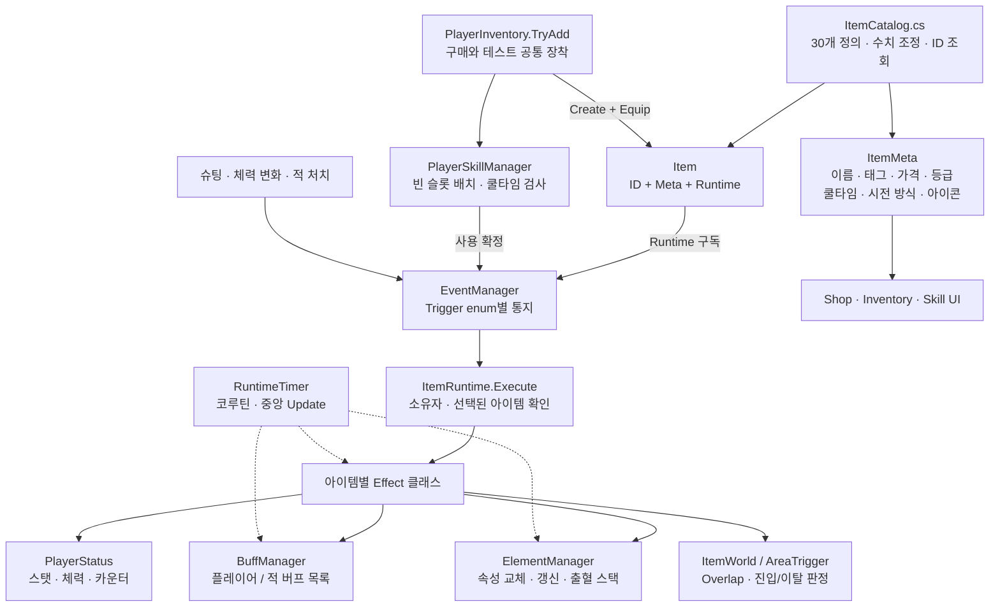

# 아이템 시스템

CSV 30개 항목을 `ItemCatalog → Item → ItemRuntime → 전용 Effect` 구조로 구현했다.
액티브 15개, 패시브 15개이며 아이템 ID는 CSV의 문자열 `"1"`부터 `"30"`까지다.
아이템 코드의 네임스페이스는 `Ujam.Runtime.Item`이다.

## 전체 흐름



`Item`, `ItemMeta`, `ItemRuntime`, `ItemEffect`는 일반 C# 객체다.
Unity의 입력·물리·프레임 갱신이 필요한 Player 컴포넌트, RuntimeTimer, AreaTrigger, DecoyController만 MonoBehaviour를 사용한다.

## 가장 먼저 수정할 곳

- 정의와 수치: `Assets/_Project/_Scripts/Item/Core/ItemCatalog.cs`
- 액티브 동작: `Item/Effect/Active/<아이템명>Effect.cs`
- 패시브 동작: `Item/Effect/Passive/<아이템명>Effect.cs`
- 공통 시스템: `Assets/_Project/_Scripts/Systems/`
- 장착 확인: `Assets/_Project/_Scripts/Test/ItemPipelineTester.cs`

새 아이템은 전용 Effect 클래스 하나를 만들고, Catalog의 `definitions`에 다음 형태로 추가한다.
기존 아이템의 반경·피해·확률·지속시간은 Effect 파일을 수정하지 않고 Catalog 생성자 인자에서 조정한다.

```csharp
new Item("31",
    new ItemMeta("새 아이템", "스킬, 원형",
        price: 100, cooldown: 10f, grade: 1,
        kind: ItemKind.Active, castType: ItemCastType.Normal,
        target: ItemTarget.Enemies, description: "아이템 설명"),
    new ItemRuntime(ItemTrigger.SkillUse,
        new NewItemEffect(radius: 2f, damagePercent: 150f)))
```

`ItemMeta`에 나중에 필드를 추가해도 Effect와 UI의 역할은 분리되어 있다.
`ItemSprite`는 아이템 이미지이고 `ActiveSkillIcon`이 없거나 Unity에서 파괴된 참조이면 `SkillIcon`이 아이템 이미지로 대체한다.

```csharp
ItemMeta meta = ItemCatalog.GetMeta("11");    // UI 조회
ItemRuntime config = ItemCatalog.GetRuntime("11"); // Trigger/Effect 설정 조회
Item owned = ItemCatalog.Create("11");        // 새 보유 개체
inventory.TryAdd("11");                       // 실제 획득 + 장착 + 빈 스킬칸 배치
inventory.TryRemove("11");                    // 해제 + 보유 목록에서 삭제
```

`Get`도 `Create`처럼 새 보유 개체를 반환한다. `Item011`, `Item_011`도 `11`로 조회된다.
같은 ID의 Meta와 불변 Effect 설정은 공유하지만, Item과 Runtime은 매번 새로 생성한다.
따라서 **Effect 필드에는 readonly 설정값만 두고**, 사용 횟수는 PlayerStatus에 Item 개체를 키로 저장한다.
시전 한 번의 대상 목록은 코루틴 지역 변수에 둔다.

직접 연결하는 경우 `Item.Equip(player, enemyMask)` / `Item.Unequip()`을 사용할 수 있다.
일반 획득은 Inventory API를 사용해야 보유 수량과 스킬 슬롯도 함께 갱신된다.

## 발동과 시전 책임

| 발신 지점 | Trigger | 용도 |
|---|---|---|
| Item.Equip | Equipped | 최대 체력, 쿨타임 감소 등 보유 효과 |
| PlayerShooter | Shooting | 기본 공격 직후 추가 효과. 빗나가면 Enemies = null |
| PlayerShooter | ShootingResolved | 슈팅과 즉시 추가 피해의 실제 합계 확정 후 흡혈 |
| PlayerSkillManager | SkillUse | 쿨타임·생존·장착 검사를 통과한 선택 슬롯의 시전 |
| 액티브 Effect의 ReportHits | SkillHit | 실제 맞은 적 목록. 지연 공격도 같은 SkillCast 유지 |
| PlayerStatus | HealthChanged | 현재/최대 체력 스냅샷 통지. 피해·회복·최대 체력 변경 |
| PlayerStatus | BeforeDeath | GameOver 판정 전에 1회 부활 처리 |
| EnemyBase | EnemyKilled | 플레이어가 처치한 적의 위치와 대상 통지 |

장착하면 해당 enum 이벤트에 Runtime.Execute가 구독되고, 해제하면 구독이 제거된다.
액티브는 이벤트의 SkillItem이 자신인 경우만 실행된다.
해제 시 진행 중인 코루틴, 생성한 장판·미끼·VFX, 자신이 부여한 플레이어 버프를 정리한다.
이미 적에게 전달된 속성은 ElementManager가 남은 수명을 관리한다.

**Preview는 추가하지 않았다.** 일반형도 D/F를 누른 순간 위치가 확정된다.
CSV의 1초/2초 지연은 시전 확정 이후의 효과 지연이며 클릭 대기가 아니다.
나중에 Preview를 넣을 때는 `TryUse`의 일반형 분기에서 위치 선택을 시작하고,
클릭 시 `ConfirmUse(slot, position)`을 호출하면 된다. Effect와 이벤트 구독은 그대로 사용할 수 있다.
쿨타임 감소율은 시전 시작 시 반영하며 이미 진행 중인 쿨타임은 다시 계산하지 않는다.

기존 PlayerSkill/PlayerSkillPreview/LightningSkill 파일은 기존 씬 참조를 보존하기 위해 남겨 두었고,
새 PlayerSkillManager는 해당 경로를 사용하지 않는다.

## Effect 작성 API

```csharp
public sealed class NewItemEffect : ItemEffect
{
    private readonly float radius, damagePercent;

    public NewItemEffect(float radius, float damagePercent)
    { this.radius = radius; this.damagePercent = damagePercent; }

    public override void Execute(ItemUseContext c)
    {
        /* VFX: c.Position에 표현을 생성한다.
           생성한 GameObject는 c.Item.Runtime.Track(instance)로 등록한다. */
        var enemies = ItemWorld.Circle(c.Position, radius, c.EnemyMask);
        foreach (var enemy in enemies) c.Damage(enemy, damagePercent);
        c.ReportHits(enemies); // 액티브의 실제 적중 통지
    }
}
```

- `c.Run(IEnumerator)`: 지연·반복 작업. 아이템 해제 시 정리되는 코루틴.
- `c.Damage(enemy, attackPercent)`: 공격력과 일반 Damage%가 적용되는 직접 피해.
- `c.Element(enemy, ElementType)`: 속성 전달. 계산·수명은 ElementManager 책임.
- `c.ReportHits(enemies)`: 액티브의 적중 결과 통지. 과부화 같은 추가 효과에서는 다시 호출하지 않는다.
- `OnEquip` / `OnUnequip`: 전용 카운터 등록·해제 등 장착 수명 작업.
- `CanExecute`: 효과 자체의 실행 조건. 쿨타임 검사는 SkillManager가 맡는다.

30개 Effect 모두 클래스/API 설명과 `/* VFX: ... */` 가이드를 포함한다.
낙뢰 외 아이템에는 실제 효과 판정과 VFX 삽입 위치를 구현했으며 별도 미술 효과는 추가하지 않았다.

## 영역 판정과 프리팹

반경과 폭은 **칸 단위**다. 원은 CellWidth, 직사각형은 CellWidth/CellHeight로 월드 크기를 계산한다.

| 형태 | 구현 | 적용 시점 |
|---|---|---|
| 원형 | ItemWorld.Circle → OverlapSphere | 한 번 조회 |
| 가로선/세로선/직사각형 | ItemWorld.Line / Box → OverlapBox | 필요할 때 조회 |
| 장판 A | PeriodicArea.Run | 생성 직후와 이후 0.5초마다 새 조회 |
| 장판 B | ItemWorld.ConditionArea + AreaTrigger | 생성 시 Overlap, 이후 OnTriggerEnter/Exit |
| 파도 | 이동하는 OverlapBox | 0.2초마다 조회, 같은 적에게 한 번 |

CSV 30개에는 장판 A 상품이 없으므로 PeriodicArea를 다음 A형 아이템의 공통 API로 제공한다.
B형은 적의 Collider가 여러 개여도 한 적으로 집계하고 마지막 Collider가 빠질 때 효과를 해제한다.
비활성화·파괴로 Exit가 생략된 Collider도 정리한다.
서로 다른 장판은 각 인스턴스를 출처로 사용하므로 한 장판에서 나와도 다른 장판의 효과는 남는다.

`Assets/_Project/Prefabs/Resources/ItemPipeline/`:

- `TriggerSphere.prefab`: 빈 루트, scale (1,1,1), SphereCollider 반경 0.5, Kinematic Rigidbody, AreaTrigger.
- `LightningBolt.prefab`: 기존 낙뢰 줄기 LineRenderer 프리팹.
- `LightningGround.prefab`: 기존 낙뢰 지면 ParticleSystem 프리팹.

Effect는 `ItemAssets.LoadAsync`에서 `Resources.LoadAsync`를 사용한다.
Catalog에는 `ItemPipeline/LightningBolt`처럼 Resources 이후 경로를 지정한다.
낙뢰는 기존 LightningSkill의 지그재그 8분할 줄기, 높이·굵기·수명, 지면 파티클 계층 스케일 동작을 옮겼다.
판정 수치는 CSV대로 반경 2칸, 1초 뒤 200% 피해 후 감전이다.
원본 VFX에 있던 누락 스크립트 참조는 복사본에서 제거하고 원본 파일은 유지했다.

## 스탯·버프·속성

PlayerStatus는 기본 공격력·공격속도·최대체력·현재체력과 아이템별 카운트를 관리한다.
최종 스탯을 읽을 때 BuffManager의 합계를 적용한다.
예를 들어 공격력 +10%, +20%면 기본 공격력 × 1.3이며 해제 시 기본 수치를 역산하지 않는다.

```csharp
BuffManager.Instance.SetTimed(player, item, BuffStat.AttackDamage, 10, 5);
BuffManager.Instance.SetCondition(enemy.Status, area, BuffStat.MovementSpeed, -20);
BuffManager.Instance.Remove(enemy.Status, area, BuffStat.MovementSpeed);
BuffManager.Instance.RemoveSource(area);
ElementManager.Instance.Apply(enemies, UJam.Runtime.Systems.ElementType.Burn);
```

같은 대상 + 같은 Source + 같은 Stat은 갱신되고, 서로 다른 Source는 합산된다.
`PlayerBuffs` / `EnemyBuffs`에서 각각 조회한다.
일정 시간은 SetTimed, 장판 내부·아이템 보유 같은 조건은 SetCondition과 명시적 Remove로 관리한다.
RuntimeTimer가 만료와 파괴된 대상 참조를 매 프레임 정리한다.

| 속성 | 현재 구현 |
|---|---|
| 화상 | 1초마다 플레이어 공격력 111% 피해 |
| 빙결 | 이동속도·공격속도 각각 -10% |
| 감전 | 받는 피해 +10% |
| 출혈 | 5스택에서 최대체력 5% 고정 피해, 최대 1000, 스택 초기화 |
| 바람 | 속성 보유만 기록. 조합/확산은 보류 |

기본 지속시간은 5초다. 같은 속성은 만료 시각을 갱신하며, 다른 속성은 이전 속성과 그 디버프를 제거하고 교체한다.
화상 재부여는 도트 주기를 밀어내지 않는다. 출혈 스택도 ElementManager 내부에 있다.
일반 Damage%는 슈팅/스킬 피해에, ElementDamage%는 속성 피해에 적용한다.
출혈은 속성 피해 배율 적용 후 상한을 적용하며 받는 피해 배율에는 영향을 받지 않는다.
경직은 BuffStat.Stun으로 구현되어 적 이동·공격을 중지한다.

## 구현된 30개 아이템

| ID | 이름 | 핵심 수치/동작 |
|---|---|---|
| 1 | 집중 사격 | 반경 0.5, 100% 피해 5회 |
| 2 | 화염구 | 반경 3, 1초 뒤 200% + 화상 |
| 3 | 약화 | 반경 2, 5초 장판 B, 공격력 -10% |
| 4 | 안개 | 반경 2, 5초 장판 B, 받는 피해 +20% |
| 5 | 중력장 | 반경 2, 5초 장판 B, 이동속도 -20% |
| 6 | 미끼덫 | HP 100, 20초간 체력 감소, 반경 3 도발 |
| 7 | 냉각 | 반경 1, 1초 뒤 경직 1초 + 빙결 |
| 8 | 가로 폭격 | 두께 1, 2초 뒤 가로줄 150% |
| 9 | 십자 폭격 | 두께 1, 2초 뒤 가로/세로 각각 120%, 교차점 2회 |
| 10 | 파도 | 5×1 판정, 10초간 +Z로 10칸, 0.2초 주기, 0.5칸 밀기 + 빙결 |
| 11 | 낙뢰 | 반경 2, 1초 뒤 200% + 감전, 기존 VFX 이식 |
| 12 | 돌풍 | 반경 2에 바람 |
| 13 | 아드레날린 | 5초간 공격력/공격속도 +10% |
| 14 | 긴급 수리 | 최대체력 10% 회복, 총 3회 후 개체 삭제 |
| 15 | 생명력 전환 | 최대체력 5%만큼 현재체력 지불, 20초간 Damage +10% |
| 16 | 은화살 | 같은 적 연속 5적중마다 100% 추가 피해 |
| 17 | 집념 | 같은 적 연속 5적중마다 2초간 공격속도 +10% |
| 18 | 화염 탄환 | 슈팅 10% 확률 화상 |
| 19 | 얼음 탄환 | 슈팅 10% 확률 빙결 |
| 20 | 전류 탄환 | 슈팅 10% 확률 감전 |
| 21 | 가시 탄환 | 슈팅 10% 확률 출혈 |
| 22 | 과부화 | 5번째 스킬의 적중 대상에게 100% 추가 피해 + 감전 |
| 23 | 염화 | 화상 계수 +20%p, 기본 111% → 131% |
| 24 | 시체 폭발 | 4처치마다 해당 위치 반경 1에 100% 피해 |
| 25 | 리저렉션 | 사망 직전 50% 체력 부활 후 개체 삭제 |
| 26 | 생명력 흡수 | 슈팅 최종 실제 피해의 2% 회복 |
| 27 | 광전사의 분노 | 체력 80/60/40/20% 이하 단계마다 공격력/공격속도 +4% |
| 28 | 벽돌 | 최대체력 +10% |
| 29 | 마공학 장치 | 쿨타임 -10% |
| 30 | 수전노 | 처치 재화 +10%, 소수 반올림 |

집중 사격은 CSV 비고대로 슈팅과 동일한 피해를 반복하며 Shooting 이벤트를 5번 발행하지 않는다.
연속 적중은 빗나감 또는 대상 변경 시 끊긴다.
과부화는 플레이어 대상 스킬이 임계 횟수이면 다음 적 대상 스킬까지 대기한다.
적 대상 시전에 보너스를 예약하므로 지연 스킬도 시전 순서를 유지하며, 그 시전이 빗나가면 보너스는 소모된다.
같은 시전에서 같은 적은 과부화 피해를 한 번만 받는다.

## CSV에서 보충하거나 해석한 값

- 가격/이미지가 없어서 가격은 등급 × 100, 아이콘은 미할당으로 두었다. Catalog에서 지정할 수 있다.
- 은화살의 추가 피해량은 미기재이므로 100%, 미끼 도발 반경은 3칸을 기본값으로 지정했다.
- 파도는 비고의 5×1 판정을 적용하고 대상란의 세로 10칸을 전체 이동 거리로 사용했다.
- 생명력 전환은 설명·비고에 따라 최대체력 자체를 줄이지 않고 현재체력을 지불한다. 지불로 사망할 수 있다.
- 가시 탄환의 발동 효과란에 적힌 전류는 이름·설명에 따라 출혈로 해석했다.
- 광전사의 분노는 효과란의 단계당 4%를 사용한다. 체력 비율과 공격력·최대체력은 올림하고 공격속도는 소수 정밀도를 유지한다.
- 출혈 임계값·비율·상한과 화상 주기는 지정되지 않아 위 기본값을 ElementManager에 두었다.
- 회수/환불 재화에는 수전노를 적용하지 않는다.

## 개발자 실행 절차

1. 기존 전투 씬의 빈 GameObject에 ItemPipelineTester를 추가한다.
2. Inventory를 연결하거나 자동 검색을 사용한다. Item Ids 기본값은 `11`, `13`이다.
3. PlayerCombatManager의 PlayerStatus, SkillManager, 카메라, GroundMask, EnemyMask 연결을 확인한다.
4. Play를 누르면 ShopBuy가 사용하는 것과 같은 Inventory.TryAdd를 통해 장착된다. 재화 차감은 생략한다.
5. 마우스를 전장에 두고 D를 누르면 낙뢰, F를 누르면 아드레날린이 즉시 확정된다. 기본 슈팅은 기존 우클릭 입력을 유지한다.
6. 패시브를 확인하려면 해당 ID를 목록에 추가한다. 액티브 슬롯은 기존 두 칸이며 세 번째 액티브는 장착에 실패한다.
7. 컴포넌트 메뉴의 `Check item contracts`로 개체 분리·이벤트 해제·버프 합산/갱신/해제를 확인한다.
8. 같은 실행에서 구성을 바꾸려면 기존 목록으로 `Unequip configured IDs`를 실행한 뒤 ID 목록을 수정하고 `Equip configured IDs`를 실행한다.

## 검증 범위

Unity 6000.0.70f1에 포함된 C# 컴파일러와 프로젝트의 실제 참조 어셈블리로 런타임 및 에디터 코드를 컴파일했다.
별도 관리 코드 실행 검사에서 CSV 30개 메타/Effect 연결, 인스턴스 분리, null 미적중, enum 라우팅,
구독 해제와 통지 중 구독 변경 등 190개 검사를 통과했다.
프리팹 3개의 로컬 참조와 외부 에셋 GUID, 30개 Effect의 VFX 가이드도 검사했다.

Unity Play Mode에서 물리 진입/이탈, 실제 전투 밸런스, VFX 렌더링은 실행하지 않았다.
ItemPipelineTester는 그 확인을 위한 씬용 도구이며 위 관리 코드 검사는 Unity 엔진의 실행 검증을 대신하지 않는다.

